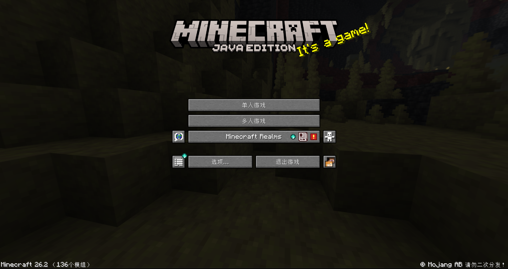

# Buildup Menu Button

> [!NOTE]
> This is a project by AI. If you mind this, please do not use this mod.

一个Minecraft 26.2客户端模组，将标题和暂停菜单恢复到老版本的经典风格按钮布局。

支持Fabric和NeoForge，同时适配Mod菜单布局和第三方紧凑按钮。

Minecraft 26.2 client mod that restores a classic-style button layout for the title and pause menus.

Supports Fabric and NeoForge. It also adapts Mod Menu layouts and the third-party compact buttons.

## SceenShots




## Feature

- 26.1.2版本以前的经典风格按钮布局
- Modmenu 图标按钮支持
- 自适应 Mod 图标按键支持 

## Docs

- [更新日志](./docs/UPDATE_NOTES.md)

## TODO

- 自定义图标按钮布局（参考：https://modrinth.com/mod/better-menu-buttons）

## Build

使用JDK25进行编译构建:

```powershell
.\gradlew.bat clean build
```

构建产物请看 `fabric/build/libs/` 和 `neoforge/build/libs/`

## License

MIT
